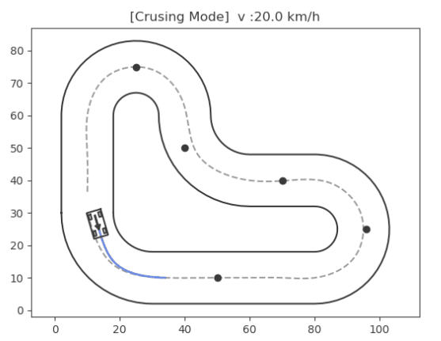
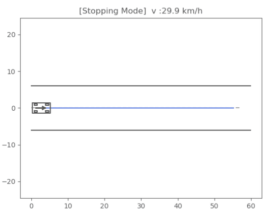
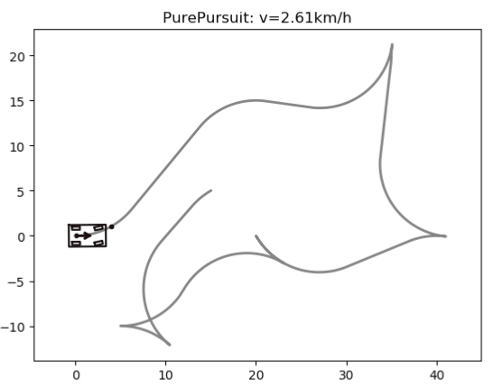
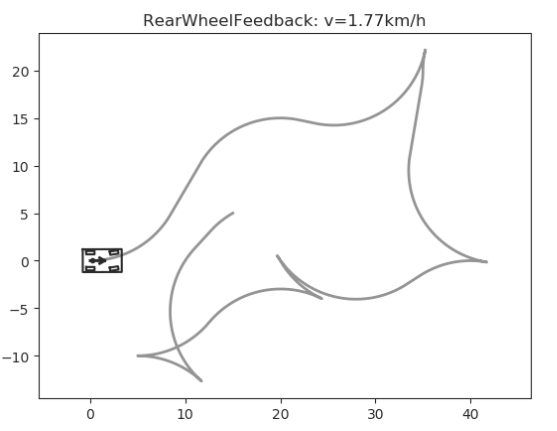
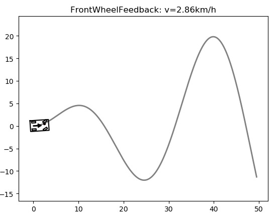
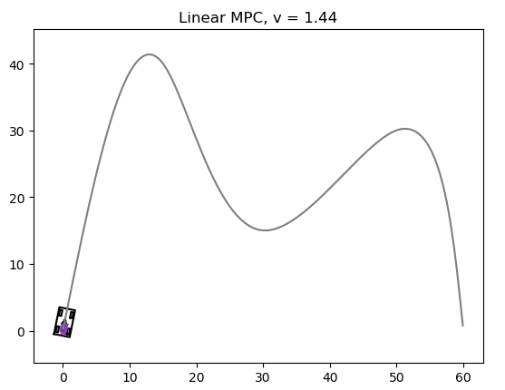
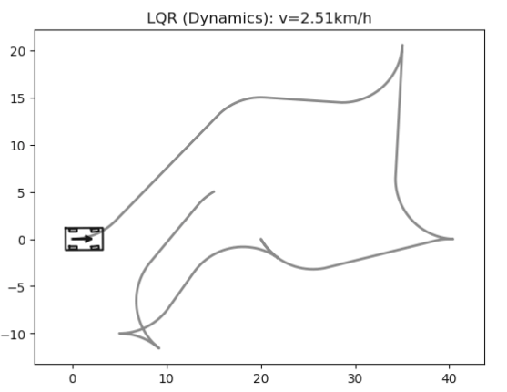

## Overview
This motion planning repository is a clone based on the GitHub [MotionPlanning](https://github.com/zhm-real/MotionPlanning) library. The README file has been modified to update the environment configuration. Currently, the State Lattice Planner has not been successfully reproduced, but other control models are functioning properly. This project includes common motion planning algorithms, particularly designed for path planning and tracking control models for autonomous vehicles.
This repository implemented some common motion planners used on autonomous vehicles, including
* [Hybrid A* Planner](https://ai.stanford.edu/~ddolgov/papers/dolgov_gpp_stair08.pdf)
* [Frenet Optimal Trajectory](https://www.researchgate.net/publication/224156269_Optimal_Trajectory_Generation_for_Dynamic_Street_Scenarios_in_a_Frenet_Frame)
* [Hierarchical Optimization-Based Collision Avoidance (H-OBCA)](https://ieeexplore.ieee.org/document/9062306) (Incomplete)

Also, this repository provides some controllers for path tracking, including
* [Pure Pursuit + PID](https://www.ri.cmu.edu/pub_files/pub3/coulter_r_craig_1992_1/coulter_r_craig_1992_1.pdf)
* [Rear-Wheel Feedback + PID](https://www.ri.cmu.edu/pub_files/2009/2/Automatic_Steering_Methods_for_Autonomous_Automobile_Path_Tracking.pdf)
* [Front-Wheel Feedback / Stanley + PID](http://robots.stanford.edu/papers/thrun.stanley05.pdf)
* [LQR + PID](https://github.com/ApolloAuto/apollo/tree/master/modules/control/controller)
* [Linear MPC](https://borrelli.me.berkeley.edu/pdfpub/pub-6.pdf)

## Requirement
* Python 3.6 or above

```
pip install -r requirements.txt
```

* [NumPy](https://numpy.org/)
* [SciPy](https://www.scipy.org/)
* [cvxpy](https://github.com/cvxgrp/cvxpy)
* [Reeds-Shepp Curves](https://github.com/zhm-real/ReedsSheppCurves)
* [pycubicspline](https://github.com/AtsushiSakai/pycubicspline)

## Vehicle models
This repository uses two models: simple car model and [car pulling trailers model](http://planning.cs.uiuc.edu/node661.html#77556).
两种模型都可以正常运行，但simple car model的速度限制较大，不适合高速行驶场景。car pulling trailers求解时间太长，不适合实时控制。
## Hybrid A* Planner
<div align=right>
<table>
  <tr>
    <td></a></td>
    <td></a></td>
  </tr>
</table>
<table>
  <tr>
    <td></a></td>
    <td></a></td>
  </tr>
</table>
<table>
  <tr>
    <td></a></td>
    <td></a></td>
  </tr>
</table>
</div>

## State Lattice Planner
状态晶格规划计算到3/4就会找不到路径
<div align=right>
<table>
  <tr>
    <td></a></td>
    <td></a></td>
  </tr>
</table>
</div>

## Controllers


<div align=right>
<table>
  <tr>
    <td></a></td>
    <td></a></td>
  </tr>
</table>
<table>
  <tr>
    <td></a></td>
    <td></a></td>
  </tr>
</table>
<table>
  <tr>
    <td></a></td>
    <td></a></td>
  </tr>
</table>
</div>

## Paper
### Planning
* [Basic Path Planning Algorithms: ](https://github.com/zhm-real/PathPlanning) PathPlanning
* [Baidu Apollo Planning module: ](https://github.com/ApolloAuto/apollo/tree/master/modules/planning) Recommended Materials
* [Survey of Planning and Control algos: ](https://arxiv.org/pdf/1604.07446.pdf) A Survey of Motion Planning and Control Techniques for Self-driving Urban Vehicles
* [Hybrid A* Planner: ](https://ai.stanford.edu/~ddolgov/papers/dolgov_gpp_stair08.pdf) Practical Search Techniques in Path Planning for Autonomous Driving
* [Frenet Optimal Trajectory: ](https://www.researchgate.net/publication/224156269_Optimal_Trajectory_Generation_for_Dynamic_Street_Scenarios_in_a_Frenet_Frame) Optimal Trajectory Generation for Dynamic Street Scenarios in a Frenet Frame

### Control
* [Baidu Apollo Control module: ](https://github.com/ApolloAuto/apollo/tree/master/modules/control) Recommended Materials
* [Pure Pursuit: ](https://www.ri.cmu.edu/pub_files/pub3/coulter_r_craig_1992_1/coulter_r_craig_1992_1.pdf) Implementation of the Pure Pursuit Path Tracking Algorithm 
* [Rear-Wheel Feedback: ](https://www.ri.cmu.edu/pub_files/2009/2/Automatic_Steering_Methods_for_Autonomous_Automobile_Path_Tracking.pdf) Automatic Steering Methods for Autonomous Automobile Path Tracking
* [Front-Wheel Feedback / Stanley: ](http://robots.stanford.edu/papers/thrun.stanley05.pdf) Stanley: The Robot that Won the DARPA Grand Challenge
* [LQR: ](https://github.com/ApolloAuto/apollo/tree/master/modules/control/controller) ApolloAuto/apollo: An open autonomous driving platform
* [Linear MPC: ](https://borrelli.me.berkeley.edu/pdfpub/pub-6.pdf) MPC-Based Approach to Active Steering for Autonomous Vehicle Systems

## Useful Material
* [HybridAStarTrailer (Julia): ](https://github.com/AtsushiSakai/HybridAStarTrailer) by AtsushiSakai
* [Hybrid Path Planner (C++): ](https://github.com/karlkurzer/path_planner) by KTH Research Concept Vehicle
